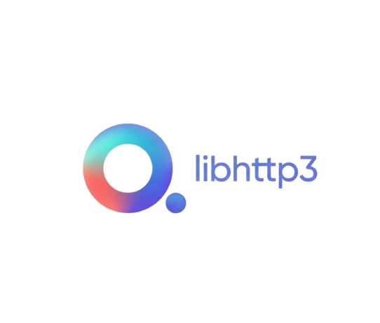

<div align="center">
  
  <br><br>
  
  
  
  
</div>

<br>

A modern, high-performance HTTP/3 and WebTransport server and client library for C++17, built on [MsQuic](https://github.com/microsoft/msquic).

Designed from the ground up around QUIC and TLS 1.3, it skips the legacy baggage of HTTP/1.1 and HTTP/2 entirely — giving you multiplexed streams, zero-RTT connection reuse, and built-in congestion control out of the box. WebTransport is a first-class citizen alongside standard request/response, with datagrams, unidirectional, and bidirectional streams all sharing the same underlying QUIC connection. The API follows familiar [cpp-httplib](https://github.com/yhirose/cpp-httplib) conventions so you can go from zero to a running HTTP/3 server in just a few lines of C++17.

---

## Getting Started

Clone the repo:

```bash
git clone https://github.com/carbon-os/libhttp3.git
cd libhttp3
```

Install dependencies via vcpkg:

```bash
git clone https://github.com/microsoft/vcpkg.git
./vcpkg/bootstrap-vcpkg.sh
./vcpkg/vcpkg install
```

Build:

```bash
cmake -B build \
  -DCMAKE_TOOLCHAIN_FILE=./vcpkg/scripts/buildsystems/vcpkg.cmake \
  -DCMAKE_BUILD_TYPE=Release

cmake --build build --config Release
```

For full build options, platform-specific notes, and TLS certificate setup see [BUILD.md](./BUILD.md).

---

## Features

- **HTTP/3** (QUIC + TLS 1.3) via MsQuic.
- **WebTransport** support (Datagrams, Unidirectional, and Bidirectional streams).
- Familiar `cpp-httplib`-style API.
- Route patterns with `:param` capture and full regex support.
- Query string parsing.
- QPACK header compression (static table + Huffman, RFC 9204).
- Lazy connection — client connects on first request and reuses the connection.
- Configurable TLS verification and CA certificate.

## Requirements

- C++17 compiler (MSVC, GCC, Clang)
- CMake 3.20+
- [MsQuic](https://github.com/microsoft/msquic) installed and findable via `find_package(msquic CONFIG REQUIRED)`

## Building

```bash
cmake -B build -DCMAKE_BUILD_TYPE=Release
cmake --build build
```

This produces:

* `libhttp3.a` (or `http3.lib` on Windows)
* `h3_server` — example HTTP/3 server binary
* `h3_client` — example HTTP/3 client binary
* `h3_webtransport_server` — example WebTransport server binary
* `h3_webtransport_client` — example WebTransport client binary

## TLS certificates

MsQuic requires a real TLS certificate. For local testing, generate a self-signed one:

```bash
openssl req -x509 -newkey rsa:2048 -keyout server.key -out server.crt \
  -days 365 -nodes -subj "/CN=localhost"
```

## Quick start: HTTP/3

### Server

```cpp
#include <http3.h>

int main() {
    http3::Server svr;

    svr.Get("/", [](const http3::Request&, http3::Response& res) {
        res.set_content("Hello, HTTP/3!", "text/plain");
    });

    svr.Get("/users/:id", [](const http3::Request& req, http3::Response& res) {
        res.set_content("User: " + req.path_param("id"), "text/plain");
    });

    svr.Post("/echo", [](const http3::Request& req, http3::Response& res) {
        res.set_content(req.body, "text/plain");
    });

    svr.listen("0.0.0.0", 4433, "server.crt", "server.key");
}
```

### Client

```cpp
#include <http3.h>

int main() {
    http3::Client cli("localhost", 4433);
    cli.enable_server_certificate_verification(false); // for self-signed certs

    auto res = cli.Get("/");
    if (res) {
        printf("status=%d  body=%s\n", res->status, res->body.c_str());
    } else {
        printf("error: %s\n", http3::to_string(res.error()));
    }
}
```

## Quick start: WebTransport

### Server

```cpp
#include <http3.h>
#include <http3/webtransport.h>

int main() {
    http3::Server svr;

    svr.WebTransport("/chat", [](webtransport::Session& sess) {
        printf("session %" PRIu64 " opened\n", sess.session_id());

        // Handle client-initiated bidi streams
        sess.on_bidi_stream([&sess](webtransport::BidirectionalStream& s) {
            s.on_data([&s, &sess](const uint8_t* data, size_t len) {
                s.write(data, len); // Echo the message back
                sess.send_datagram(data, len); // Broadcast as datagram
                s.close_write();
            });
        });

        // Handle datagrams
        sess.on_datagram([&sess](const uint8_t* data, size_t len) {
            sess.send_datagram(data, len);
        });

        sess.wait(); // Block until the session is closed
    });

    svr.listen("0.0.0.0", 4433, "server.crt", "server.key");
}
```

### Client (Standalone)

```cpp
#include <http3/webtransport.h>

int main() {
    webtransport::WebTransport client("https://localhost:4433/chat");
    client.verify_cert(false);

    std::unique_ptr<webtransport::Session> sess = client.connect();
    if (!sess) return 1;

    webtransport::BidirectionalStream* s = sess->open_bidi_stream();
    s->on_data([](const uint8_t* data, size_t len) {
        printf("Reply: %.*s\n", (int)len, data);
    });

    s->write("Hello Server!");
    s->close_write();

    sess->close();
}
```

---

## HTTP/3 API reference

### Server

```cpp
// Register routes
svr.Get    ("/path", handler);
svr.Post   ("/path", handler);
svr.Put    ("/path", handler);
svr.Delete ("/path", handler);
svr.Head   ("/path", handler);
svr.Options("/path", handler);
svr.Patch  ("/path", handler);

// Custom 404 / error handler
svr.set_error_handler(handler);

// Start (blocks until stop() is called)
svr.listen("0.0.0.0", 4433, "server.crt", "server.key");
svr.listen("0.0.0.0", 4433, "server.crt", "server.key", "h3"); // custom ALPN

svr.stop();
svr.is_running();
```

#### Route patterns

| Pattern | Example match |
| --- | --- |
| `/users/:id` | `/users/42` → `req.path_param("id") == "42"` |
| `/files/:dir/:name` | `/files/docs/readme` |
| `R"(/items/(\d+))"` | Raw regex — full `std::regex` syntax accessible via `req.matches` |

#### Request

```cpp
req.method          // "GET", "POST", …
req.path            // "/users/42"
req.query_string    // "foo=bar&x=1"
req.body            // request body as std::string
req.headers         // std::multimap<string, string>
req.params          // parsed query params
req.matches         // std::smatch — regex captures

req.has_header("content-type")
req.get_header_value("content-type", "text/plain")
req.has_param("page")
req.get_param_value("page", "1")
req.path_param("id")
```

#### Response

```cpp
res.status = 200;
res.set_content("body text", "text/plain");
res.set_header("x-custom", "value");
res.set_redirect("/new-location");      // 302
res.set_redirect("/new-location", 301); // permanent
```

### Client

```cpp
http3::Client cli("localhost", 4433);

// TLS
cli.enable_server_certificate_verification(true);
cli.set_ca_cert_path("/path/to/ca.crt");

// Timeouts (seconds)
cli.set_connection_timeout(10);
cli.set_read_timeout(30);

// Methods
auto res = cli.Get    ("/path");
auto res = cli.Get    ("/path", headers);
auto res = cli.Post   ("/path", body, content_type);
auto res = cli.Post   ("/path", body, content_type, headers);
auto res = cli.Put    ("/path", body, content_type);
auto res = cli.Delete ("/path");
auto res = cli.Head   ("/path");
auto res = cli.Options("/path");
auto res = cli.Patch  ("/path", body, content_type);

// Sharing the multiplexed QUIC connection for WebTransport
std::unique_ptr<webtransport::Session> wt = cli.WebTransport("/wt");
```

#### Result

```cpp
if (res) {                          // true on HTTP success (any status)
    res->status                     // int
    res->body                       // std::string
    res->headers                    // std::multimap<string, string>
    res->get_header_value("etag")
} else {
    http3::to_string(res.error())   // human-readable error
}
```

#### Error codes

| Error | Meaning |
| --- | --- |
| `Error::Connection` | Could not connect or connection lost |
| `Error::ConnectionTimeout` | Timed out waiting to connect |
| `Error::ReadTimeout` | Timed out waiting for response |
| `Error::SendFailed` | Failed to send request |
| `Error::QpackError` | QPACK decode failure |
| `Error::ProtocolError` | Unexpected HTTP/3 framing |

---

## WebTransport API reference

```
webtransport::Session* — returned from connect() and cli.WebTransport()
  ├── nullptr on connection failure
  ├── open_bidi_stream()             → BidirectionalStream*
  ├── open_send_stream()             → SendStream*
  ├── send_datagram(data, len)       → bool
  ├── on_bidi_stream(cb)             — client-initiated bidi streams
  ├── on_receive_stream(cb)          — client-initiated receive-only streams
  ├── on_datagram(cb)
  ├── on_close(cb)                   — fires with (uint32_t code, string_view reason)
  ├── wait()                         — block until session closes
  └── close(code, reason)            — send WT_CLOSE_SESSION and FIN

webtransport::BidirectionalStream
  ├── write(data, len)               → bool
  ├── close_write()
  ├── reset(app_error)
  ├── on_data(cb)
  └── on_close(cb)

webtransport::SendStream
  ├── write(data, len)               → bool
  ├── close_write()
  └── reset(app_error)

webtransport::ReceiveStream
  ├── on_data(cb)
  └── on_close(cb)

webtransport::Error
  Success, Connection, Rejected, Timeout, Protocol
```

## Running the examples

```bash
# Terminal 1 — HTTP/3 server
./build/h3_server server.crt server.key 4433

# Terminal 2 — C++ HTTP/3 client
./build/h3_client localhost 4433

# Terminal 1 — WebTransport server
./build/h3_webtransport_server server.crt server.key 5010

# Terminal 2 — C++ WebTransport client
./build/h3_webtransport_client localhost 5010

# Terminal 2 — Go test suite (requires github.com/quic-go/quic-go)
cd tests
go run client.go -addr localhost:4433 -insecure -count 5
go run webtransport_client.go -addr localhost:5010 -insecure -v
```

## Project layout

```
include/
  http3.h                  ← public API (only file users need)
  http3/
    webtransport.h         ← WebTransport session + stream types
    http3_defs.h           ← frame types, stream types, error codes
    http3_varint.h         ← QUIC variable-length integer codec
    http3_frame.h          ← H3 frame builder / parser, StreamBuf
    http3_qpack.h          ← QPACK encoder / decoder
    http3_client_impl.h    ← Client::Impl and ReqState
    http3_server_impl.h    ← Server::Impl, Route, SrvConnCtx, SrvStreamCtx
    http3_wt_impl.h        ← WebTransport internal implementation classes
src/
  http3_varint.cpp
  http3_frame.cpp
  http3_qpack.cpp
  http3_server.cpp
  http3_client.cpp
  http3_webtransport.cpp
examples/
  server.cpp
  client.cpp
  webtransport_server.cpp
  webtransport_client.cpp
tests/
  client.go                ← Go test suite; Go's quic-go stack has one of the
                             most mature QUIC/HTTP3/WebTransport implementations
                             available, making it a reliable independent client
                             for validating interoperability against the C++ server
```

## Platform Support

| Platform | x86_64 | ARM64 |
| --- | :---: | :---: |
| Windows | Supported | Supported |
| Linux | Supported | Supported |
| macOS | Supported | Supported |

## Limitations

* QPACK static table only — no dynamic table, no server push
* Single-process; no built-in thread pool for handlers (each request dispatches synchronously on the MsQuic callback thread)
* No HTTP/1.1 or HTTP/2 fallback

## License

Released under the [MIT License](./LICENSE) — © 2025 Netangular Technologies, Inc.

---

## References

* [MsQuic](https://github.com/microsoft/msquic) — Microsoft's cross-platform QUIC implementation
* [yhirose/cpp-httplib](https://github.com/yhirose/cpp-httplib) — API design and handler conventions
* [RFC 9114](https://www.rfc-editor.org/rfc/rfc9114) — HTTP/3
* [RFC 9204](https://www.rfc-editor.org/rfc/rfc9204) — QPACK header compression
* [RFC 9000](https://www.rfc-editor.org/rfc/rfc9000) — QUIC transport
* [RFC 7541](https://www.rfc-editor.org/rfc/rfc7541) — HPACK / Huffman coding (used by QPACK)